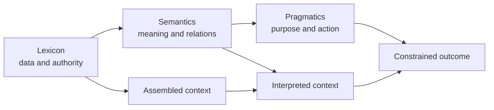

# What We Mean by Context Engineering

Before we dive into architectures, retrieval systems, or knowledge graphs, we need to establish what this book is—and what it is not.

This is not a book about prompt engineering.

It is not a collection of clever prompts, jailbreaks, or prompt templates. It is not a guide to squeezing another two percent out of a frontier model by finding the perfect wording. Those techniques have their place, but they are only one layer of a production system.

This book is about engineering the background that makes a language system's work possible: the right information, at the right time, in a usable form, for an authorized purpose, with measurable constraints.

That is context engineering.

## The central spine: Lexicon → Semantics → Pragmatics

Context engineering is a systems discipline for language and information processes. Its recurring questions are best organized as a progression:

**Lexicon** asks what data, entities, definitions, sources, and authorities exist. It includes provenance, ownership, sensitivity, freshness, jurisdiction, and the boundaries of what is available. The data may remain distributed across databases, APIs, documents, indexes, and event streams. What matters is that the system can identify relevant sources, scope access, and distinguish authoritative information from an incidental or stale copy.

**Semantics** asks what those entities and relationships mean in this domain, task, and time. Schemas, taxonomies, identifiers, entity resolution, ontologies, knowledge graphs, and typed metadata make meaning explicit. A model should not have to reconstruct an organization's concepts and relationships from accidental examples in a prompt. Semantic infrastructure gives a language process the distinctions it needs to interpret information correctly.

**Pragmatics** asks what an actor may say or do with that meaning, for which purpose, and under which constraints. A proposed answer, extraction, classification, recommendation, workflow step, or tool call has an intended use and possible consequences. Structured outputs, narrow interfaces, policy checks, authorization, human review, and execution boundaries help ensure that an output is appropriate before it becomes an external effect.

These are not three product features or a framework reserved for agents. They are the questions that connect retrieval, state, semantics, authorization, orchestration, tools, evaluation, cost, and reliability into one context-to-outcome pipeline.

## Three ways context reaches a language process

The same discipline appears under different retrieval postures. In prompt-time
assembly, the application retrieves candidate material, ranks it, truncates it
to a budget, and splices the result into the model input before generation.
The application owns the selection policy, so the working set can be inspected
and reproduced as an input artifact.

In agent-directed retrieval, the model receives a search or fetch capability
and decides what to request during a loop. Each result becomes a new observation
that may lead to another request. This can make retrieval adaptive, but the
system must account for additional turns, tool failures, and the possibility
that the agent never asks for the source that would have settled the question.

Hybrid systems seed the first prompt with high-confidence context and expose a
bounded retrieval capability for the gaps that remain. The important point is
not that one posture is universally correct. It is that each makes a different
part of context selection explicit: the application, the model, or a bounded
combination of both.

The distinction matters because “retrieval” describes two different ownership
models. If the harness already knows the task's required facts, prompt-time
assembly is usually the stronger reliability posture: authorize the request,
construct the candidate set, rank eligible evidence, apply deterministic record
and token budgets, and compile the selected material into a versioned model
input. The model receives a working set that can be inspected, replayed, and
compared across ranker versions. Ranking may use probabilistic signals—lexical,
vector, graph, learned, or pairwise—but the scope, cutoff, budget, serialization,
and admission rules are owned by the system.

Tool-mediated retrieval matters when the next context requirement cannot be
known before execution: the answer depends on an intermediate observation, the
source is dynamic, an external action is required, or the tool exposes a narrow
capability whose use is itself part of the workflow. The model may decide when
to ask for more context, but the system must decide what that request is
permitted to expose. A tool call is an adaptive acquisition step, not a transfer
of data-access policy to the model.

| Context posture | Who chooses when to retrieve? | What the system must make deterministic |
| --- | --- | --- |
| Prompt-time compilation | Harness | authorization, candidate boundary, ranking inputs, cutoff, budgets, provenance, and serialized prompt |
| Scoped tool retrieval | Model proposes; host authorizes | tool capability, identity and purpose scope, result bounds, validation, lineage, and execution state |
| Hybrid | Harness seeds; model requests bounded gaps | seed manifest, tool scope, per-call limits, admission, and final evaluation |

The decision rule is practical: compile context ahead of time when the required
evidence and policy boundary are known; expose a scoped tool when useful context
depends on execution; use both when a reliable seed can reduce uncertainty while
the remaining questions are genuinely dynamic. Do not make a generic corpus
search tool the default merely because the model can issue queries.

This is why context engineering is broader than retrieval and broader than
agents. It governs the working set at the boundary where information becomes
available to a language process, regardless of whether that set was pasted,
ranked, fetched through a tool, or assembled from workflow state. The working
set is finite even when the source system is not. More accessible data can add
cost and distract from the evidence that matters; reliable systems therefore
make selection, scope, order, and budget observable.

## A systems discipline, not an agent label

Throughout the AI industry, teams build increasingly sophisticated model integrations while neglecting the engineering required to supply those models with reliable information. The result is predictable: hallucinations, incorrect tool calls, poor personalization, security problems, runaway costs, and brittle workflows. Some failures are genuine model-capability limits. Many others originate in the surrounding information system, and that is the class of failure this book teaches you to diagnose and control.

Agents are an important current application, but they are not the definition of the field. The same foundations apply to search, information extraction, classification, summarization, recommendation, workflow automation, and other language systems. In each case, the model is one participant in a larger pipeline. The system must assemble relevant context, expose the meaning needed for the task, and constrain what the result can mean or cause.

For that reason, this book adopts a precise definition: context engineering is the discipline of delivering appropriate information and control signals to a language process during the appropriate stage of a workflow. The objective is not to provide every piece of information that might eventually become useful. It is to provide what is relevant to the current decision, represented in a form the process can use, and bounded by the authority and purpose of that decision. Reliable systems are built by controlling information flow, not by maximizing context size.

## Context is assembled, not simply stored

This distinction becomes especially important when discussing context graphs.

While reading the MIT Press *Knowledge Graphs* text, I encountered one useful definition of a context graph that differs significantly from how the term is used in some modern AI discussions. In the focused-crawling literature, a context graph can guide a crawler through a particular domain. A domain model supplies entities or relationships, and the crawler uses that structure to decide where to traverse next. In that setting, the graph guides information discovery within a constrained problem space.

That definition is useful because it is precise.

Because the term is overloaded, this book will use *context graph* for a graph that guides context discovery or assembly. Conversation history, a memory database, and cross-session persistence are state stores. They may feed a context graph or be queried during context assembly, but they are not interchangeable concepts.

A context graph models a domain so that information can be discovered efficiently. Context engineering, on the other hand, is the broader discipline responsible for deciding what information should be retrieved, when it should be retrieved, how it should be represented, who is authorized to access it, and how it should be presented to the language process.

Those are different responsibilities, even when they are implemented in one product.

## Cross-cutting dimensions of context

Lexicon, Semantics, and Pragmatics are the primary organizing questions. The familiar temporal and syntactic dimensions describe how context changes and is represented across that spine; they do not replace it.

**Temporal context** cuts across all three layers. Lexical sources change, meanings are versioned, and permissions or acceptable actions can expire. A reliable system therefore asks not only what a fact means, but when it was true, when it was retrieved, which version of a definition applies, and whether an instruction or authorization is still valid. Context should arrive when it becomes relevant to the current task, rather than being placed at the beginning of a workflow simply because it might be useful later.

**Syntactic context** is the representational mechanism through which lexicon and semantics become available to a model or downstream process. Language models consume ordered sequences of tokens, and extraction systems consume fields, schemas, and delimiters; organization therefore matters. The same information can be more or less usable depending on its structure, ordering, serialization, labels, and interface. Syntax makes meaning available, but it does not supply authority or guarantee a correct interpretation.

Pragmatic context remains concerned with intended use, including instructions, examples, tool descriptions, permissions, and conversational expectations. Semantic context remains concerned with meaning and relationships. Temporal and syntactic choices shape how both reach the process and how reliably it can use them.

Together, these dimensions provide a practical diagnostic. When a system misbehaves, ask which Lexicon, Semantics, or Pragmatics assumption failed, then ask whether the information arrived at the wrong time or in the wrong structure. Finally inspect the enforcement layer: retrieval filters, provenance, schemas, authorization checks, workflow state, and evaluation—not only the prompt.

## The category boundary

Prompt engineering shapes instructions supplied to a model. Retrieval supplies candidate information. Memory is often a user-facing metaphor for state implemented with databases, event logs, knowledge stores, and retrieval systems. Guardrails are individual constraints or checks. Agent engineering focuses on delegated action and orchestration. Context engineering includes these techniques where useful, but also handles authority, scope, meaning, state, and downstream constraints across agentic and non-agentic systems.

As we move through the book, we will spend considerably more time discussing information systems than prompt construction. The value is not memorizing APIs or copying code samples. It is understanding the principles well enough to direct implementation tools effectively and recognize when they are building the wrong thing.

By the end of the book, you should be able to inspect any context-to-outcome pipeline through the same three questions:

- **Lexicon:** What sources and entities does it expose? Who owns them? What is authoritative, current, sensitive, or missing?
- **Semantics:** How does it represent identity, relationships, definitions, uncertainty, and provenance? What meaning is explicit instead of inferred?
- **Pragmatics:** What task or speech act does it enable? Which actor is authorized? Which constraints are checked before an output becomes an external effect?

Whether you are building customer-facing software, a search system, an extraction pipeline, a classifier, a recommendation engine, a summarizer, a workflow, an agent, or a production SaaS platform, the underlying challenge is the same: reliability depends on controlling what information and authority reach the language process, preserving the state a workflow needs, and measuring whether the complete system improved.

That is the discipline of context engineering.
