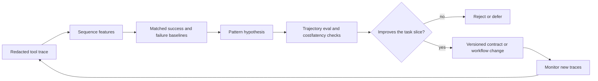

# Tool Usage Patterns Are Design Evidence

A tool trace is structured context about the system itself. It records proposals, validation decisions, identity and scope resolution, authorization, executions, observations, retries, and outcomes over time. Aggregating those events can reveal where a pragmatic action contract or workflow should change. It does not prove what the user intended, establish lexical authority, or authorize the system to automate a newly discovered pattern.

## Model the Sequence, Not Just the Count

Represent each event with a run and workflow version, tool and contract version, state before and after, resolved identity and scope, source authority and freshness, validated argument class, authorization outcome, attempt, latency, cost, result class, and terminal task outcome. Preserve protected arguments and results by reference.

Counts answer “which tool is common?” Sequences answer more useful questions:

- Which proposal-validation failures recur after a particular observation?
- Which tool pairs precede duplicate effects or successful completion?
- Where do retries repeat a permanent failure?
- Which states consume cost without observable progress?
- Which tool version correlates with recovery or regression on the same task slice?

Correlation is not a workflow specification. A frequent sequence may reflect a bad interface, a retry storm, biased traffic, or an attack. Compare it with successful and failed baselines, control for task type and version, inspect traces, and test the proposed change in Chapter 17’s evaluation harness.

The trace must make that comparison possible. At minimum, retain an event identity and timestamp, run and task identifiers, tool and contract versions, state before and after, proposal and validation outcomes, authorization outcome, attempt number, latency, cost, result class, and terminal task outcome. Join those events to the trajectory rather than reducing them to a tool-count dashboard. The curriculum's `03_Agents_101/README.md` names the harness as a model, toolbox, budget, and trace; `09_Agent_Evals/README.md` evaluates the whole trajectory with repeated `pass^k` runs; and `22_Observability/README.md` adds spans, quality-on-traffic, drift, and saturation. Together they define the minimum comparison surface for a pattern claim.

Useful measures include tool-call precision (calls that contribute to the task), repeated-call rate, loop rate, recovery rate by error class, p95 tool latency, cost per successful task, and the spread of steps and tool output across repeated runs. None is a universal objective: a search-heavy task may need more calls than a lookup, and a high recovery rate can mean either resilience or a noisy first attempt. Slice by task, principal, tool version, and failure class before treating a change as an improvement.

## Turn a Pattern Into a Bounded Change

Suppose many runs call `search_customer`, receive several identities, then call it again with a slightly different string. The response is not to let the model search indefinitely. Candidate changes include returning stable identity candidates in one typed result, adding an explicit disambiguation state, or requiring user confirmation before selecting an identity.

Evaluate candidate recall, false identity selection, attempts, latency, cost, and downstream effects. If the change wins, version the tool contract and workflow. Do not silently teach the model a sequence from telemetry or convert a correlation into automatic authority.

The change loop is deliberately conservative: observe, form a hypothesis, compare against a matched baseline, run trajectory evaluation, inspect side effects, then ship a versioned change with a rollback condition. A trace can explain what happened and help locate an anomaly; it cannot by itself explain why the user acted, supply missing authorization, or turn a common sequence into policy.

Temporal event extraction research such as [TwiCal](https://aclanthology.org/D11-1057/) is an analogy for representing event, time, entity, and context. It is not evidence that tool patterns are correct or useful, and it does not authorize automation. Here the reliability gain comes from structured operational events, controlled comparison, and an enforceable redesign.

Chapter 16 owns collection and protected lineage; Chapter 17 owns experimental proof. This module’s narrower point is that tool traces can feed contract design when their patterns are treated as hypotheses rather than instructions.
