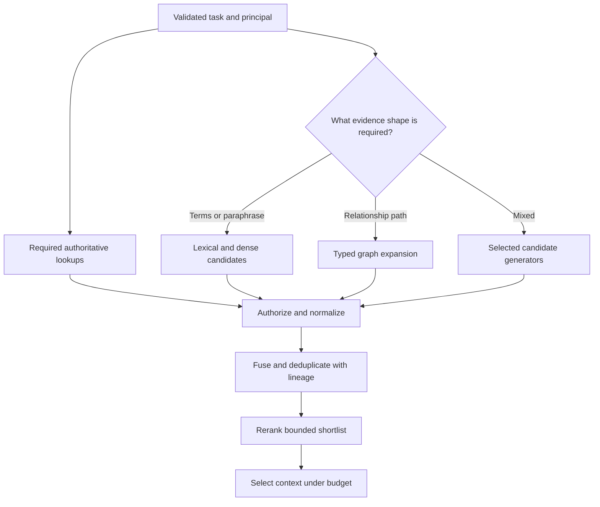

# ch09.03 Graph and Hybrid Retrieval

## Retrieve Relationships When Relationships Are the Evidence

“Which services depend on the payment database?” requires explicit dependency paths, not merely documents similar to “payments.” Graph retrieval begins from resolved entities and follows allowed relationship types under depth, time, authorization, and cost limits.

Those paths are graph-generated candidates for an answer or for evidence
retrieval. Entity resolution, edge semantics, scope, validity, and provenance
must be checked before a path is treated as usable context.

A graph does not automatically supply causality or temporal order. An edge must encode the relationship the query needs, with provenance and validity. “Occurred after” is not “caused by,” and a permission path is evidence for an authorization service—not a grant the model may interpret for itself.

Use graph paths when they are the answer or route to evidence. Use search to discover unlinked passages. A dense or lexical result can seed entity resolution, and graph neighbors can seed document retrieval, but every transition needs a typed contract.

The curriculum's GraphRAG module makes the graph hypothesis testable: a strong
dense-plus-BM25-plus-reranker baseline must be measured against graph retrieval
on the same evaluation cases. A graph is useful when its relationship structure
recovers evidence the baseline misses, not merely because its output looks more
explainable.



## Hybrid Candidate Generation Means Planned, Not Everything at Once

Running relational, lexical, dense, and graph retrieval for every request increases latency and candidate noise. A planner should select sources from the validated task:

Required lookups do not compete in a relevance ranking. They populate typed context slots. Ranked evidence candidates can be fused after authorization and normalization.

Reciprocal Rank Fusion is a useful score-agnostic baseline because it combines rank positions rather than incomparable raw scores:

```text
RRF(document) = sum(1 / (k + rank_i(document)))
```

The constant and contributing lists are configuration, not universal truth. Weighted fusion, learned rerankers, and rule-based boosts may perform better for a particular corpus. All can amplify correlated errors when retrievers share the same stale or biased source.

The source implementation is `06_Advanced_Retrieval/Retrieval_Ladder.py`,
Task 3 (“Fuse, rerank, expand”). Its compact RRF baseline is:

```python
# Source: 06_Advanced_Retrieval/Retrieval_Ladder.py, Task 3
def rrf(rankings: list, k: int = 60) -> list:
    scores = {}
    for ranking in rankings:
        for rank, chunk_id in enumerate(ranking, 1):
            scores[chunk_id] = scores.get(chunk_id, 0.0) + 1 / (k + rank)
    return sorted(scores, key=scores.get, reverse=True)
```

The curriculum then scores every rung with hit rate and mean reciprocal rank,
and compares permission filtering inside the query with dropping unauthorized
results after ranking. The latter can leak counts, gaps, and rank positions;
authorization is therefore part of candidate generation, not cleanup.

> **NOTE:** These excerpts illustrate the retrieval ideas and point back to the
> training curriculum. The book does not yet have a source repository for these
> implementations; create that repository before treating the examples as a
> maintained book companion.

## Preserve Result Lineage

Deduplicate by canonical source or entity rather than text alone. Preserve which retrievers found each candidate, ranks, graph paths, filters, corpus versions, and exclusions. A graph-derived candidate should carry its path; a document candidate should carry its passage locator.

Evaluate routing and fusion through ablations: lexical only, dense only, graph only, selected combinations, and an oracle route. Measure task-specific recall, precision, latency, cost, unauthorized candidates, and downstream claim support. A hybrid pipeline is justified only when its gain survives the operational cost and failure injection.

### Attribute Graph Misses Before Tuning the Graph Route

The usual case for adding graph retrieval is that dense search finds what is *similar* while traversal finds what is *connected*. The [hybrid retrieval research note](../../../../research/hybrid-retrieval-architectures.md) frames a four-route design—dense, BM25, rank fusion, and graph traversal—in exactly those terms. That division is a sound hypothesis for queries whose evidence is a relationship path. It is not evidence that a graph route will help a given workload: any reported graph lift bundles a corpus, a query mix, a judgment set, and whichever edges that system's ingestion happened to create. Treat a published or project-reported gain as a reason to run the ablation above, not a substitute for it.

When the graph route misses required evidence, classify the miss before changing traversal. The edge may never have been extracted or promoted, which is an ingestion defect owned by the extraction pipeline in Chapter 7. The query entity may not have resolved to the right node. The needed path may exceed the configured depth or relation types. Or authorization may have correctly removed it. Record the class alongside the candidate's lineage. Each class has a different owner, and only the third is fixed by tuning the graph route.

The next module turns selection, fusion, reranking, and budgeting into an explicit query plan.
