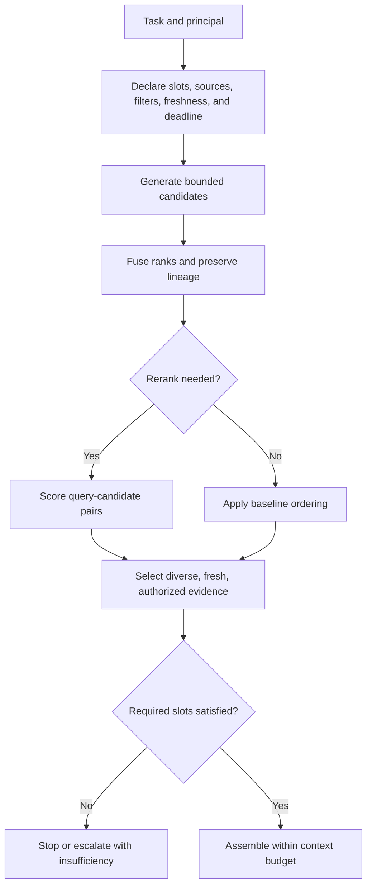

# ch09.04 Ranking, Reranking, and Query Planning

## Define “Right” Before Ranking

Retrieval quality is task-relative. A policy answer needs authoritative, effective evidence. Incident discovery may prioritize recall. A destructive action needs required facts and authorization rather than a plausible top-ranked passage.

The same query-planning boundary serves non-agentic systems as well as
delegated-action systems: a search result page, an extraction or classifier,
a recommendation, a summary, a workflow decision, and an agent response may
all need different required slots, evidence candidates, and stop conditions.

The query plan should declare required slots, optional evidence, eligible sources, filters, freshness, deadlines, candidate budgets, fusion, reranking, and stop conditions. The model may help interpret an ambiguous request, but application policy owns authority and source scope.

Make that plan inspectable before execution:



## Keep Candidate Stages Observable

Lexical, dense, graph, and hybrid retrieval generate candidates and usually
optimize cheap recall. Reranking spends more computation on a smaller set
using richer query–document interaction or task features. Final selection
satisfies context role and token budgets.

Do not compare BM25, cosine, graph cost, and database values as if their raw scores shared a scale. Normalize or fuse ranks, then train or tune reranking on judgments that match the task. Preserve pre- and post-rerank lists so regressions can be located.

Deduplication, freshness, authority, and diversity are not cosmetic postprocessing. Near-duplicate chunks can crowd out independent evidence. A highly relevant obsolete policy should lose to the current authoritative policy. Diversity helps only when the task benefits from multiple perspectives; it can hurt a precise lookup.

### Relative Ranking Is Not Verification

Pairwise comparison can make reranking more useful when absolute scores are poorly calibrated. A
judge compares two already-eligible candidates under the same task and answers which appears more
useful. A small, well-connected set of such comparisons can be aggregated with a Bradley–Terry
model into latent strength estimates. The model is a way to allocate attention across candidates;
it is not proof that the winner is correct, authoritative, or even better on every dimension.

The comparison graph should be designed rather than allowed to grow as every possible pair. Compare
new candidates with strong incumbents, preserve enough connectivity to expose disagreement, and
reserve expensive downstream evaluation for candidates that survive the cheap signal. This is the
resource-allocation pattern described by SIFT, not a reason to let a judge determine final context
admission. Pairwise comparison tells us what deserves inspection. Deterministic evaluation tells us
what is allowed to survive.

The single-strength assumption also matters. A candidate can be fresh but less authoritative,
diverse but less directly relevant, or useful for one task and harmful for another. Preserve the
dimensions that matter to the task and evaluate the selected context against the actual outcome;
do not hide them behind one score. See [the ranked context selection research note](../../../../research/ranked-context-selection.md)
for the Bradley–Terry equation, sparse-comparison tradeoffs, and the distinction between ranking,
tree search, and verification.

## Plan for Failure and Budget

One deadline governs the plan. Required sources can stop inference; optional sources can degrade under declared policy. Reserve context space for instructions, structured state, evidence, and output rather than allowing the largest retriever to consume the window.

Test routing errors, empty results, stale indexes, contradictory authorities, reranker outages, duplicate floods, embedded instructions, and budget pressure. Compare the planner with simple baselines. Measure selection accuracy, required-slot satisfaction, ranking metrics, latency, cost, and task outcome.

Reliable retrieval does not use every primitive. It knows why each candidate is eligible, how it was ranked, and when insufficient evidence means stop. The final module defines measurements for that boundary without pretending one equation captures system quality.

The curriculum implements this as a ladder in
`06_Advanced_Retrieval/Retrieval_Ladder.py`: dense and BM25 candidates, RRF,
a cross-encoder reranker, and multi-query expansion are scored on the same
cases. It then ships the cheapest rung that clears the task's bar. The
implementation is illustrative; a maintained source repository for the book's
examples remains a separate follow-up.

```python
# Source: 06_Advanced_Retrieval/Retrieval_Ladder.py, Task 3
def rerank_search(query: str, k: int = K) -> list:
    candidates = hybrid_search(query, N_CANDIDATES)
    return rerank(query, candidates, k)
```

The omitted `hybrid_search` and `rerank` definitions remain in the curriculum;
this excerpt shows the boundary being measured, not a new implementation for
the manuscript repository.
