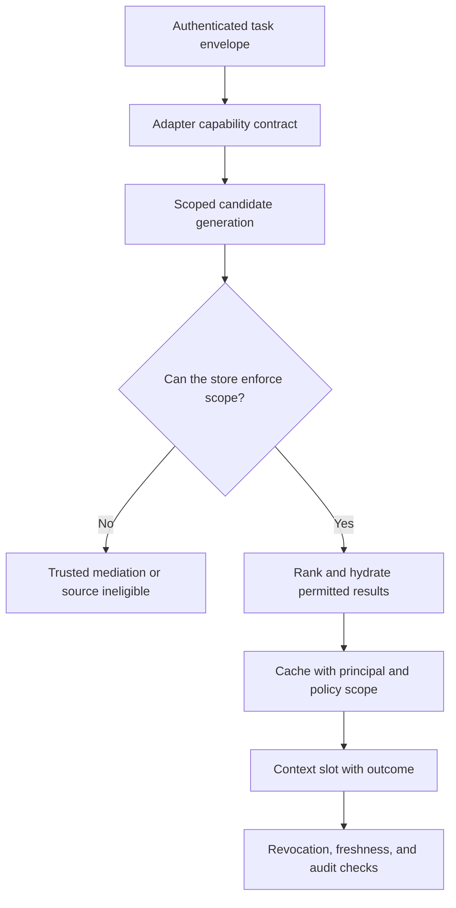

# ch10.02 Scoped Hydration Across Stores

## One Policy, Many Enforcement Semantics

Scoped hydration means that each context slot is populated only from resources the active principal may use for the declared purpose. It is the Lexicon-to-context part of the spine: source authority and scope determine what may enter; semantic typing and relation checks determine how it may be combined; pragmatic policy determines what the assembled slot may support. A wiki, relational database, search index, graph, API, and cache expose different controls. A canonical request envelope can coordinate them, but it cannot erase those differences.

The product claim should stay precise: users do not want “memory” as an
independent feature. They want engineered context—the right current facts,
preferences, constraints, and history assembled for this task, under the right
authority and purpose. Memory stores, retrieval indexes, summaries, and caches
are implementation mechanisms. If they leak scope, preserve stale state, or
surface irrelevant history, the product has failed even if its memory feature
appears to work.

Each adapter must declare which actions and filters it can enforce, how identity is bound, whether authorization affects ranking, and what failure means. If a backend cannot enforce the required scope, the source is ineligible for that task or needs a trusted mediation layer.

Make the weakest adapter visible before it contributes context:

The curriculum's memory exercise demonstrates the same principle with separate
stores for two users and a leakage test: scope is part of the store boundary,
not a sentence in the prompt. The guardrail ladder also fails closed when a
check raises. These are illustrative training assets; a maintained source
repository for the book examples still needs to be created.

## Push Authorization into Candidate Generation

Post-filtering is insufficient when unauthorized candidates influence ranking, counts, snippets, graph expansion, cache keys, or timing. Apply tenant, principal, purpose, and classification constraints before or during search whenever possible.

- **Wiki/document systems:** evaluate page, space, inherited, and exception rules before returning content or snippets.
- **Relational databases:** use parameterized predicates, views, or row-level policies with trusted session identity; select only necessary columns.
- **Search/vector indexes:** index enforceable scope metadata and filter candidate generation; deletion and ACL changes must propagate.
- **Graphs:** authorize starting nodes, edges, intermediate expansion, endpoints, and hydrated source records.
- **APIs/tools:** send delegated identity or a narrowly scoped service credential and re-authorize server-side.

Database connection pooling deserves care. Session attributes must be set transactionally and cleared reliably; a pooled connection carrying the previous principal is a cross-tenant failure. “Connect as the user” is one design, not an automatic guarantee.

## Govern Derived Paths and Caches

A visible endpoint does not imply a visible relationship. A permitted document does not imply permission to reveal its search neighbors. Cache entries need principal- and policy-aware keys or content whose reuse is safe across scopes. Invalidate on revocation, consent change, source deletion, and policy-version change.

The assembler should preserve per-slot outcomes: satisfied, empty, denied, stale, unavailable, and unsupported enforcement. These are meaningful distinctions in both Semantics and Pragmatics: “denied” is not “no such fact,” and “unsupported” is not permission. Do not translate denial into absence or retry it with a stronger service identity.

## Test the Weakest Alternate Path

Test direct lookup, search, snippets, aggregates, graph counts, caches, exports, and error messages. Inject wrong tenant, revoked access, inherited wiki exceptions, a stale index ACL, a pooled-identity leak, and a graph path whose endpoints are public but edge is sensitive.

Measure unauthorized candidate and inclusion rates, denied-versus-empty correctness, revocation propagation, policy latency, cache-scope failures, and required-slot outcomes. Scoped hydration is reliable when every contributing store can demonstrate enforcement under the same authenticated task—not when all stores merely receive the same attribute JSON.

The next module records the Lexicon evidence and transformations required to audit those decisions and the context derived from them.
