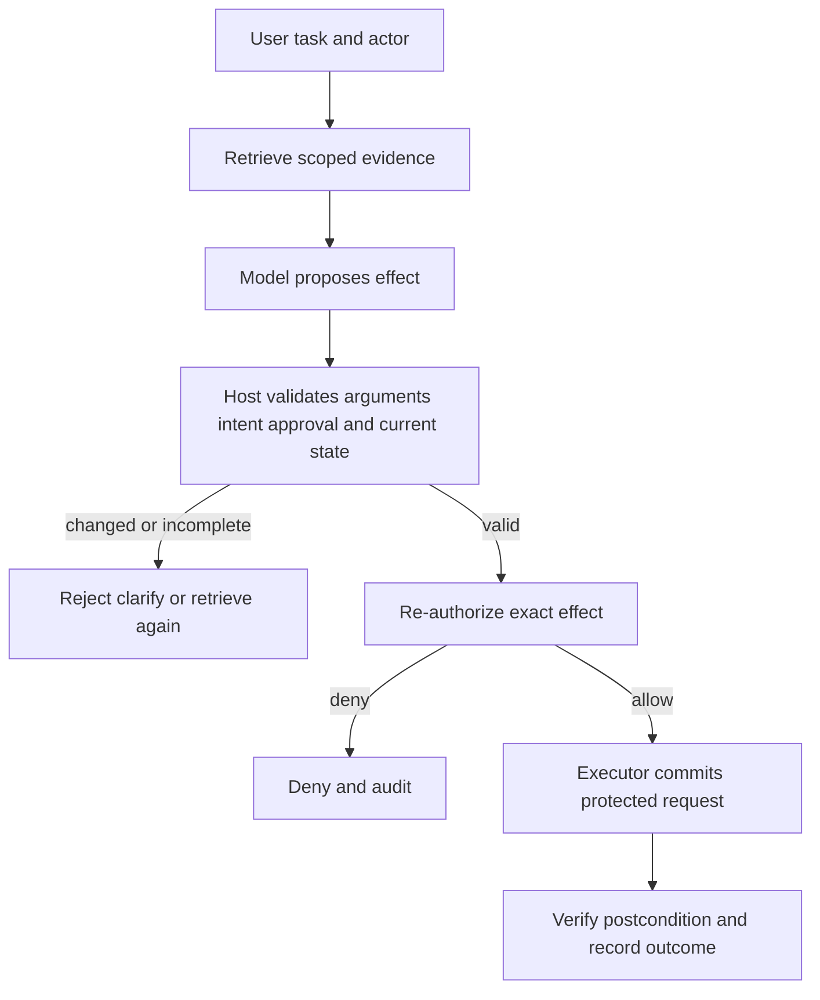

# ch11.04 Retrieval and Execution Boundaries

## Retrieved Context Is Not Authority to Act

A language system may retrieve a payment record to explain it without being
allowed to refund it. Retrieval and execution need separate authorization
because they protect different resources, actions, purposes, and consequences.

The retrieval grant scopes evidence for a stated purpose. The execution grant
scopes a proposed effect and should be derived only after arguments, current
state, actor intent, and required confirmation are validated. Never forward
arbitrary retrieved text into a privileged sink as if read permission made the
content trustworthy.

The boundary is a product boundary as much as a security boundary: the user
wants an answer or an approved outcome, not an agent that quietly turns
retrieved text into authority. Treat retrieved content as evidence and a tool
proposal as an untrusted request until the host validates it.

## Re-authorize at Commit

Time passes between reading and acting. Policy, resource version, approval, and user intent can change. At execution, re-check:

- authenticated principal and actor;
- exact tool, resource, action, and protected fields;
- purpose and task/transaction identity;
- current policy and resource version;
- confirmation or approval evidence;
- idempotency and quantitative limits.

Bind the grant to those values so changing an amount, recipient, or resource invalidates it. The host—not the model—constructs the protected request.

## Contain a Deceived Model

Authorization cannot prevent a language process from being manipulated. It can
prevent a manipulated proposal from exceeding verified authority when every
path to the resource passes through the enforcement point. Claims of structural
impossibility require that completeness; alternate tools, service credentials,
caches, and direct network access can bypass the intended boundary.

Test time-of-check/time-of-use changes, replay, altered protected fields, stale confirmation, duplicate execution, retrieved prompt injection, and an alternate unguarded route. Measure unauthorized execution attempts, bypass coverage, ambiguous commits, replay rejection, and postcondition mismatches.

Least privilege improves reliability when it constrains both evidence and effects. The final module asks whether permitted retrieval was also necessary for the task.
