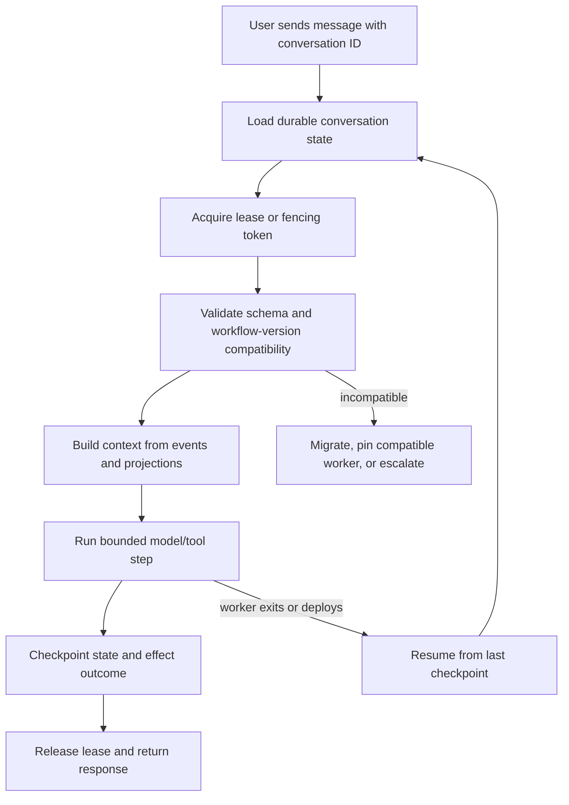
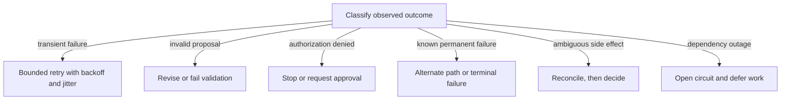

# Loops, Retries, and Bounded Autonomy

Agent loops turn one uncertain model call into a sequence of dependent decisions. The same control problem appears in retrying extraction, iterative review, and event-driven automation. Loops can increase capability, but they also compound cost, stale context, duplicated actions, and earlier errors. A production loop therefore needs more than `while not done`. It needs a progress definition, resource budgets, classified outcomes, and a terminal-state policy owned by software.

## Assign Decisions by Invariant

The right boundary is not “software handles easy decisions; the model handles hard ones.” Some easy-looking decisions carry authority or irreversible effects. Assign them according to what must be guaranteed:

| Decision | Model contribution | Software obligation |
|---|---|---|
| Select evidence | Propose relevance | Enforce scope, provenance, freshness, and budget |
| Choose a tool | Propose an operation and arguments | Validate schema, state, authorization, and risk |
| Revise a plan | Propose new steps | Preserve committed effects and validate dependencies |
| Retry work | Suggest an alternate strategy | Classify failure and enforce retry policy |
| Complete a task | Draft an answer or completion claim | Check required outcomes and terminal transition |
| Perform a side effect | Prepare intent | Re-authorize, deduplicate, execute, and record |

Rules belong in software when they express invariants. Judgment can belong to the model when the result remains a proposal and the harness can check its consequences. Retries are workflow policy, not model decisions. This is bounded autonomy: freedom inside a boundary that does not depend on the model remembering it.

## Define Progress Before Repeating

Iteration limits prevent an infinite bill, but they do not make a loop productive. Define observable progress for the task: a required evidence slot filled, a validation error resolved, a plan dependency completed, or uncertainty reduced according to a specified measure. A new paragraph of model output is not necessarily progress.

Each iteration should record:

- the state and plan version it began from;
- the proposal and validation decision;
- tools invoked and outcomes observed;
- which progress condition changed;
- resources consumed; and
- the next allowed state.

Stop when the task succeeds, a required outcome becomes impossible, no progress occurs within a bounded window, a budget expires, authorization disappears, or operator review is required. Quality thresholds are useful only when the evaluator has been validated for the task. A model grading its own answer is a signal, not an objective completion oracle.

Context also needs a loop policy. Do not append every prior prompt and response indefinitely. Preserve durable facts, tool observations, provenance, decisions, and unresolved constraints as structured state. Compact narrative history separately, and test whether compaction removes information required for the next decision.

## Restore Conversations Across Deploys

For a chat product, the durable unit is not the worker process and not the model's in-memory conversation. It is a versioned conversation record keyed by a stable conversation identifier. That record should contain the accepted user and tool events, a compact context projection, the current workflow state, pending work, authorization and policy references, deployment or workflow-definition version, and idempotency keys for effects already attempted. A streamed token buffer may improve the user experience, but it is not the source of truth for whether a turn completed.

The next pod must be able to load that record, acquire ownership, reconstruct the next context, and continue from a known checkpoint. It must not infer completion from the last visible assistant message or rerun a tool merely because the old pod disappeared. A conversation can therefore survive a rolling deployment without pretending that an interrupted turn produced a final answer: the new worker resumes the pending state, reconciles any ambiguous effect, and either completes the turn or reports that it needs attention.

Rolling deployment makes compatibility an explicit workflow concern. Old and new pods overlap, so readers and writers need a compatibility window: additive state changes first, readers that tolerate both versions, then a migration or removal after old workers drain. Stop accepting new work before terminating a pod, checkpoint or finish its current turn, and use a lease or fencing token so an old pod cannot commit after a new pod has taken ownership. A deployment is complete only when the rollout is healthy *and* in-flight conversations can be restored under the new version. This is engineered context and state, not a promise that the model remembers.

## Retry Failures, Not Business Decisions

Retries are safe only for classified outcomes. A timeout on an idempotent read may be retried with exponential backoff and jitter. Invalid arguments should return to proposal or validation, not repeat the same call. Authorization denial is terminal until authority changes. An ambiguous external side effect requires reconciliation before another attempt.

A circuit breaker protects a struggling dependency by temporarily rejecting or deferring calls after repeated failures. It is not a substitute for per-run attempt limits, and retrying every worker simultaneously can worsen an outage. Global concurrency limits, jitter, backpressure, and a retry budget matter alongside the local policy.

## Grow Autonomy One Boundary at a Time

Start with one model call inside a fixed workflow. Add typed output when prose parsing fails. Add a tool boundary when the system needs external data or effects. Add durable state when work must survive requests or crashes. Add governed retrieval, semantic constraints, and authorization when the task crosses data and action boundaries. Add loops only when feedback from one bounded attempt improves the next.

Every added layer creates new failure modes: stale state, schema drift, policy disagreement, duplicate effects, recovery bugs, and evaluator gaming. Instrument those boundaries before expanding autonomy. Useful chapter-level measures include task success by terminal state, invalid proposals, no-progress exits, retry success by failure class, duplicate side effects, budget overruns, recovery success, and human interventions.

The reliability question is not how autonomous the agent appears. It is whether the surrounding system can explain what happened, constrain what may happen next, and recover safely when the model or infrastructure is wrong. That question applies to every context-to-outcome workflow. Once those controls are explicit, the next constraint is economic: how much context and orchestration the task can justify.
