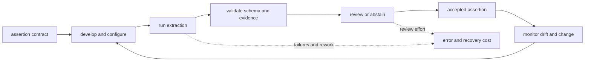

# NER vs. LLM Extraction Costs

“NER versus LLM extraction” is not one benchmark. NER labels spans and types; information extraction may also resolve identity, extract relations and events, preserve qualifiers, and map assertions into a schema. Cost comparisons are meaningless until the required output contract and evaluation unit are the same.

## Price Development and Operation

A supervised extractor may require annotation guidelines, labeled examples, training, deployment, monitoring, and retraining. An LLM pipeline may require prompt and schema design, demonstrations, model calls, validation, review, and repeated evaluation when the model changes. Rules have development and maintenance costs too.

The cost is a lifecycle, not a per-call price:



The comparison unit should therefore be an accepted assertion, not a raw extraction call. A cheap call that creates invalid, unsupported, or unreviewable output has not produced cheap context.

Model the horizon explicitly:

```text
total_cost(method, horizon) = development
                            + annotation
                            + inference_per_item * volume
                            + validation_and_review
                            + error_and_recovery
                            + maintenance_and_migration
```

There is no universal break-even volume. It depends on hardware and service prices, batching, document length, label stability, review rates, error consequences, and the frequency of change. Determinism also needs precision: conventional software can be reproducible under fixed versions and inputs, while trained inference may still vary across runtimes and language-model services may change unless versions are pinned. This is a decision model, not a runnable extractor; implementation examples belong in a maintained source repository rather than in the manuscript.

## Evaluate the Same Contract

Build a versioned evaluation set from the production distribution. Measure span and type quality for NER; relation arguments, direction, qualifiers, temporality, and provenance for relation extraction. Add schema-validity rate, abstention, review burden, latency, and cost per accepted assertion. Slice by document type, language, length, and rare class. Confidence is an input to review routing, not a substitute for validation: a score is useful only if it predicts correctness well enough for the consequence at hand.

An LLM may reduce time to a first prototype or support a changing label description. A specialized model may provide better throughput or quality on a stable distribution. Neither follows from the method name. Compare trained, prompted, rule-based, and hybrid candidates on the same hardware or fully loaded service cost and the same downstream decision.

## Account for Change

Schema churn can favor a configurable approach, but prompt changes also require regression testing and historical reprocessing. A stable schema can justify amortizing labels and training, but distribution drift still creates maintenance. Keep raw evidence and extraction versions so derived data can be rebuilt regardless of method.

The least expensive extractor is the one that meets the assertion contract at the lowest expected lifecycle and error cost. That conclusion must be earned on the task’s data, not inherited from an ownership-versus-usage slogan.
