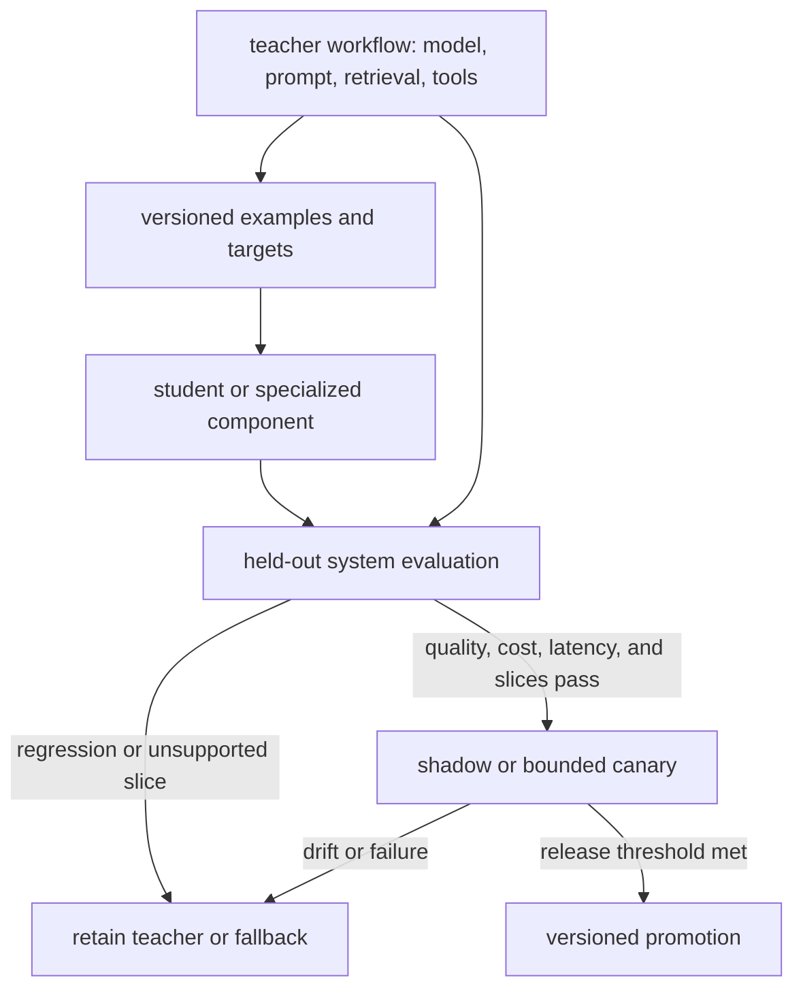

# Distillation and Specialized Models

Distillation, small models, and specialization change the system’s cost and capability envelope. They are not upgrades in a single direction. Each trades development and evaluation work for a model that may be cheaper, faster, more deployable, or better on a bounded distribution.

## Distill a Defined Behavior

Knowledge distillation trains a student using targets produced by a larger model or ensemble; the foundational formulation uses the teacher’s softened output distribution as training signal [Hinton, Vinyals, and Dean, 2015](https://arxiv.org/abs/1503.02531). Modern language-model pipelines may also use generated rationales or demonstrations, but the reliability obligation is the same: teacher errors and omissions can enter the student data.

Keep the transfer boundary explicit:

The student is not evaluated against a teacher snapshot in isolation. It is evaluated against the complete teacher workflow and the product contract, with the teacher or another fallback still available when the student abstains or drifts.

Distill only after defining the target distribution and acceptance tests. Compare the student with the complete teacher workflow, including prompts, retrieval, validation, and review. Measure cost per success, tail latency, important slices, abstention, and regressions. A student can outperform its teacher on a narrow evaluation through task-specific training; it is therefore too broad to claim that distillation always produces reduced fidelity.

## Treat “Small” as a Deployment Property

Parameter count does not predict task reliability by itself. Architecture, tokenizer, training data, quantization, context length, runtime, and hardware affect both quality and serving cost. A small language model may be attractive for constrained hardware, privacy boundaries, predictable throughput, or a narrow task. Local serving removes network dependency but adds capacity planning, patching, monitoring, and incident ownership.

Benchmark the deployed artifact, not a model-family reputation. Test context length with concurrency, malformed inputs, languages, rare classes, tool schemas, and the exact quantization. A smaller model may need more explicit structure; it may also need less context for a narrow trained behavior. Neither direction is guaranteed.

## Specialize the Smallest Necessary Layer

“Specialized model” can mean a classifier, reranker, extractor, embedding model, language model, or adapter. Prefer the narrowest component that addresses the diagnosed failure. If a classifier can route documents reliably, training an entire language model expands cost and risk without necessity.

Specialization is justified when the task distribution and labels are stable enough to maintain, volume repays development, and failures can be evaluated. Keep authoritative facts outside weights, preserve the surrounding authorization and validation boundaries, and maintain a fallback for distribution shift.

Record the teacher version, target-generation policy, student data fingerprint, model artifact, serving configuration, and slice results together. This is a release artifact, not merely a training log. Illustrative training code should live in a maintained source repository; the manuscript carries the decision boundary and the measurements that make replacement accountable.

The decision is empirical: compare the general model, adapted model, distilled student, and narrow specialized component against the same system contract. Choose the least expensive candidate that meets the reliability constraints.
