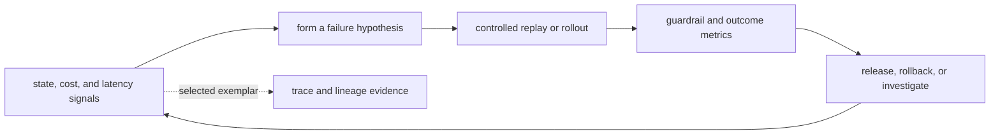

# State, Cost, and Latency Observability

Tracing one failed run is necessary but insufficient. Production reliability also depends on aggregate signals: authoritative sources going stale, semantic transformations losing coverage, policy checks denying or allowing unexpected work, workflows stuck in a state, costs concentrated in retries, latency hidden in a tail, or a new model-input version degrading one task slice.

## Observe State Transitions

Emit an event or span for each attempted and committed workflow transition with run ID, prior and next state, workflow version, expected and committed state versions, guard outcome, and failure class. Derive metrics for time in state, invalid-transition attempts, stale-write conflicts, recovery outcomes, terminal states, and operator interventions.

Avoid putting run IDs, user IDs, prompts, URLs, or arbitrary error messages into metric labels. Their unbounded cardinality can make the metrics backend costly or unusable. Keep low-cardinality dimensions in metrics and connect selected measurements to detailed traces through exemplars or run references.

## Attribute Cost to Outcomes

Count input and output tokens, retrieval and reranking work, semantic transformation work, policy checks, tool calls, retries, storage, serving compute, human review, and recovery. Attach them to task class, source/representation/model-input version cohort, and terminal outcome. Chapter 14’s cost-per-success framing prevents a cheap failed attempt from looking efficient.

Budgets should produce observable policy decisions: admitted, degraded, deferred, rejected, or exhausted. Alert on budget violations and unexpected distribution changes, not on every expensive run. A high-cost run may be correct for a high-consequence task.

## Measure the Critical Path and Its Tail

Record queue time, source access, retrieval, semantic transformation, context assembly, each required dependency, model time to first token, generation, policy validation, tools, and persistence. Use traces to identify the critical path and metrics to monitor p50, p95, and p99 by task class. Track deadlines, cancellations, retries, fan-out, cache age, stale-source and degraded-transformation outcomes.

Instrumentation has overhead and failure modes. Export asynchronously where safe, bound queues, define behavior when collectors are unavailable, monitor dropped telemetry, and ensure telemetry failure does not silently block the production path. Tail sampling may retain errors or slow traces, but its buffering and policy are operational costs too.

## Turn Telemetry Into Evidence

Dashboards and correlations do not establish causality. Use traces to form a hypothesis, then evaluate a controlled change on a versioned dataset or randomized rollout where appropriate. Record assignment, exposure, outcome, and guardrail metrics. Chapter 17 will make that evaluation discipline explicit.

The operational loop is:

Metrics reveal that a population changed; traces and lineage help explain a selected case. Keep those roles separate. A p95 increase, a rising refusal rate, or a falling evaluation score is an alert to investigate, not a causal explanation.

Telemetry retention is not permanence. Schemas evolve; stores expire data; privacy requests require deletion; access policy changes. Version telemetry contracts and preserve only the minimum durable lineage required for audit and reproducibility.

Observability makes context engineering more reliable when it shortens detection and diagnosis, supports safe experiments, and exposes regressions before they become repeated effects. The trace is evidence—not the source of truth for every domain fact, and not an explanation of the model’s mind.

The source observability notebook illustrates these signals with a measured span, a simulated quality regression, a drift rule, and a bounded load test. Those examples show what to measure; production instrumentation and alerting belong in a maintained source repository.
