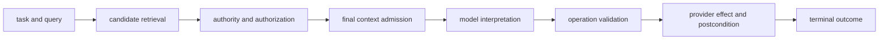

# Retrieval and Operation Evaluation

End-to-end quality cannot tell you which system boundary improved. Evaluate context acquisition and external operations separately, then test their composition. A tool is one implementation of an operation interface; the same concerns apply to a search result, database write, API request, workflow transition, or human handoff.

Use a staged evaluation boundary:

A score at one stage is not evidence that every later stage succeeded. Candidate recall can rise while final admission falls; a valid operation can still be unauthorized; a successful provider response can still leave the workflow in the wrong state.

## Evaluate Retrieval in Stages

Define the retrieval unit—document, passage, assertion, entity, or path—and a bounded relevance set for each task. Measure lexical coverage, candidate recall, judged precision, ranking metrics where order matters, source authority, provenance, authorization violations, freshness, latency, and cost. Then measure final admission: which required evidence entered the model or downstream process, which was excluded, and why.

Recall denominators are often incomplete. Pool candidates from multiple systems and human search, record unjudged items, and avoid presenting partial judgments as exhaustive truth. Relevance also does not imply authority or usefulness. Evaluate citation support and downstream decisions separately.

Run retrieval ablations against the same model inputs: oracle evidence, no retrieval, each route alone, hybrid routing, and the production policy. This separates acquisition and authority failures from semantic interpretation and model failures, and shows whether extra candidates earn their cost.

## Evaluate Operations as Contracts and Effects

Test schema validation, authorization, scope, idempotency, deadlines, retry classification, ambiguous outcomes, and postconditions with deterministic fixtures and failure injection. Measure operation-proposal validity, correct routing when an operation is required, argument correctness, denied-operation rate, duplicate effects, recovery success, and terminal task outcome.

An operation-selection score is insufficient if the chosen operation is unauthorized, semantically wrong, or its effect is wrong. Use sandboxed or simulated providers for destructive tests, and verify that diagnostic replay cannot execute live effects.

The evaluation stack progresses from deterministic component tests, through workflow scenarios with controlled dependencies, to repeated behavioral evaluation and guarded production measurement. Each layer localizes a different class of failure; none replaces the others.

The source evaluation notebooks illustrate retrieval and tool behavior with corpus cases, trajectory repeats, and release metrics. They are teaching assets, not a production retrieval or execution implementation; runnable examples belong in a maintained source repository.
