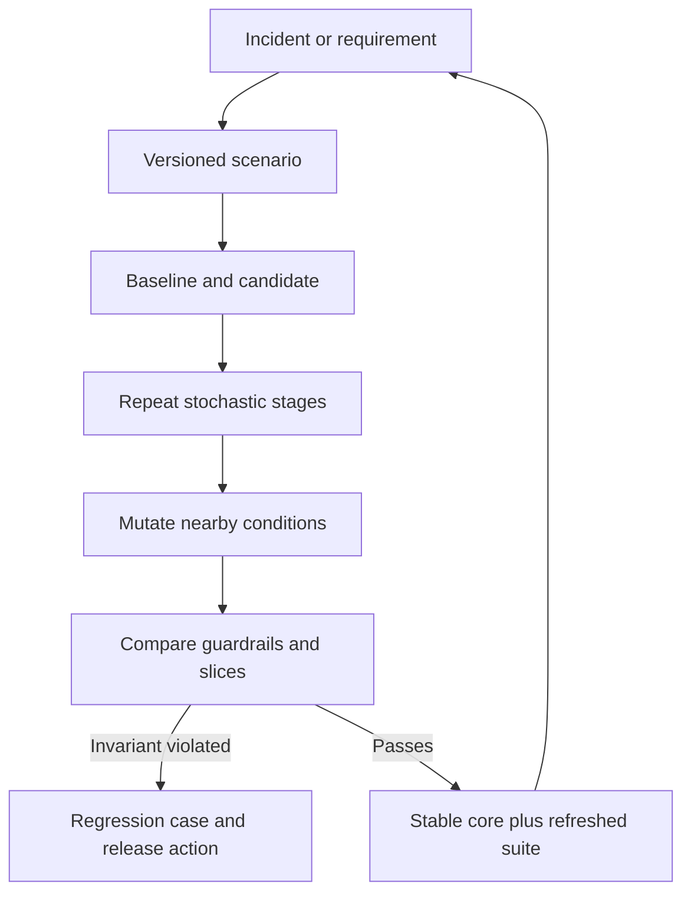

# Regression and Scenario Testing

AI regression testing should compare context-to-outcome invariants and distributions, not prose strings. Exact equality remains appropriate for typed records, authority and authorization decisions, state transitions, and committed effects. Semantic flexibility belongs only where the requirement permits it.

## Build Scenarios Around Failure Boundaries

A scenario specifies initial state, identity and authority, source versions, expected lexical coverage, semantic target, model and policy versions, injected dependency behavior, expected transitions, allowed output variation, and terminal outcome. Include happy paths, missing or unauthorized evidence, stale data, conflicting sources, ambiguous meaning, prompt injection, timeouts, duplicate delivery, denied operations, and crash recovery.

Run baseline and candidate on paired scenarios. Repeat stochastic stages enough to expose meaningful variation, then compare task success and guardrails by slice. Freeze external observations when testing logic; separately test current integrations to detect dependency drift.

The replay boundary must be explicit. Store protected references to the trace, fixture, prompt, tool contract, model and policy versions, and external observations needed to reproduce the run. A source notebook can demonstrate planted regressions, repeated trajectories, case fingerprints, and recovery checks; it is a teaching asset, not the maintained source repository for production test harnesses. Keep runnable implementations in that source repository so the book example and the system under test do not silently diverge.

## Turn Incidents Into Reproducible Cases

Every material incident should produce an error-taxonomy entry and the smallest scenario that reproduces its boundary failure. Preserve protected trace references and versions. A single incident case prevents one recurrence; nearby mutations test whether the fix generalized rather than memorized the example.

Regression suites can become unrepresentative as production changes. Track case provenance, age, duplicates, slice coverage, and retirement decisions. Keep a stable core for longitudinal comparison and a refreshed set for current traffic.

A version improves when it meets predefined aggregate and slice thresholds without violating hard invariants. Different wording is not a regression; a different internal path is not a regression; a coverage gap, authority error, semantic distortion, unsupported claim, invalid operation, changed effect, or forbidden transition is.
