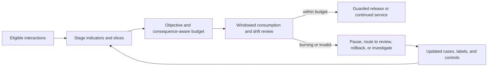

# Reliability Metrics and Failure Budgets

A model score is not a service reliability objective. Production AI needs metrics that connect system boundaries to user-visible and consequential outcomes.

## Define Indicators and Objectives

Choose indicators by task and pipeline stage: source and authority coverage, evidence-supported claim rate, semantic correctness, required-context coverage, invalid or unauthorized operation rate, duplicate-effect rate, recovery success, successful terminal outcome, latency, availability, and cost per success. Add model-quality measures such as calibrated answer correctness, extraction accuracy, ranking quality, or summary fidelity only when they match the task. Define the eligible population and exclusions so the denominator cannot drift silently. Report important slices and confidence intervals where sampling applies.

An objective states the acceptable level over a window. A failure budget is the permitted shortfall from that objective—for example, unsuccessful eligible interactions—not the current percentile divided by a latency threshold. Latency objectives usually specify the proportion of requests that must complete below a threshold; their budget is the allowed proportion that does not.

The denominator is part of the contract. Define which interactions are eligible, which exclusions are legitimate, how retries and duplicate delivery count, and how missing labels are handled. Report the numerator, denominator, window, and slices together. Otherwise a team can improve a dashboard by changing who counts as a request or by hiding the cases that are hardest to judge.

Do not combine every failure into one fungible budget. A missing authoritative source, a semantic error in a product description, and an unauthorized payment are not interchangeable. High-consequence invariants may require zero tolerated observed violations plus prevention, audit, and incident controls; that does not claim zero underlying risk.

## Use Budgets to Govern Change

Track consumption rate and remaining budget over rolling and calendar windows. Segment by version, task, tenant class, and dependency. When consumption accelerates, pause risky releases, reduce optional automation, route to review, or restore a known-good version. “Tighten the budget” means demand greater reliability; accepting more risk loosens it.

Cost is a constraint, not necessarily a failure event. Couple cost limits with outcome objectives so an optimization cannot win by refusing expensive valid work, reducing lexical coverage, or starving semantic context.

## Keep Evaluation Continuous and Governed

Refresh cases from production with privacy and selection controls. Version datasets, prompts, judges, labels, and scoring code. Monitor evaluator drift and disagreement. Review whether offline measures predict guarded production outcomes, and retire metrics that no longer do.

Treat metric movement as a trigger for investigation, not as an explanation. A feature or prediction distribution can drift without the measured outcome worsening, while a silent quality regression can leave infrastructure dashboards green. Pair the indicators with sampled end-to-end evaluation, trace review, and explicit detection lag; record which actions an alert permits and which require human confirmation. The source observability notebooks illustrate these measurements and planted changes, but runnable monitoring belongs in a maintained source repository.

Reliability improves when an explicit claim survives component tests, scenarios, held-out evaluation, and production observation. Budgets make the acceptable risk visible; they do not make all risks acceptable.
