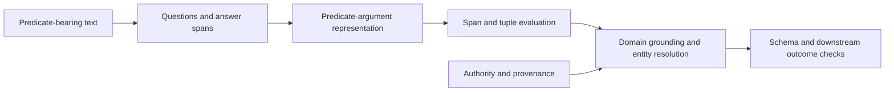

# QA-Driven Semantic-Role and Extraction Benchmarks

Question-answer representations can make predicate-argument structure inspectable without forcing every argument into a small role-label inventory. They are useful benchmark constructs, not a universal production extraction schema.

## What the Benchmarks Represent

[QA-SRL](https://aclanthology.org/D15-1076/) associates predicates with constrained natural-language questions and answer spans. [QAMR](https://aclanthology.org/N18-2089/) crowdsources question-answer pairs intended to capture a broader range of sentence relationships. [LSOIE](https://arxiv.org/abs/2101.11177) converts QA-SRL annotations into OpenIE tuples at larger scale.

For “The model generated a summary,” a QA-SRL-style representation might ask “Who generated something?” and “What was generated?” The questions expose predicate and arguments, but they do not resolve the model’s identity, establish whether generation occurred, or map the relation into a domain ontology.

## Match the Evaluation to the Representation

Measure question generation, answer-span detection, and tuple conversion separately. Exact span scores can penalize semantically equivalent boundaries; semantic matching can over-credit unsupported answers. Inspect both aggregate scores and error categories such as missing predicates, missing arguments, wrong attachments, redundant questions, and conversion loss. Treat these as model-quality and semantic checks within the larger pipeline, not as evidence of source authority or downstream reliability.

The evaluation unit must stay visible. A question can be well formed while its answer span is wrong; a span can be correct while the tuple loses a qualifier; and a tuple can be plausible while its source is unauthorized or stale. Preserve the source sentence and offsets through each conversion, and report failures at the stage where they first appear. Dataset scripts and parsers are useful research or teaching assets; runnable production extraction belongs in a maintained source repository rather than being implied by a manuscript example.

These datasets differ in annotation process and target representation. Do not merge their headline scores or claim that one QA pipeline can verify itself. An extractor and verifier sharing prompts, models, or annotations can share the same error. Use independent evidence or review for consequential assertions.

## Transfer Carefully

Use these benchmarks to test a relevant linguistic capability or seed an annotation design. Build a domain set for the documents, languages, relations, qualifiers, and source-grounding requirements the production system actually faces. Preserve source spans and evaluate downstream entity resolution, schema validation, and task outcomes.

Do not transfer a headline score across representations. QA-SRL, QAMR, and LSOIE differ in what annotators were asked to cover, how answers are delimited, and whether the target is a question-answer set or an OpenIE tuple. A domain benchmark should therefore publish its annotation instructions, exclusions, adjudication rules, split policy, and conversion rules alongside its scores.

QA-driven representation improves reliability when it makes candidate structure easier to inspect and test. It does not establish lexical coverage or provenance, remove the need for authorization, or substitute for domain and outcome evaluation.
