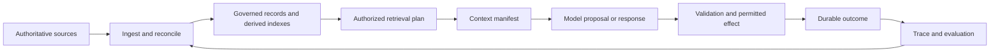

# Source and Ingestion Architecture

A production context platform is not a required stack of databases. It is a set of enforceable contracts connecting sources, derived representations, task-time decisions, and measured outcomes. Start with the failure semantics and add components only when a workload needs them.

Think of the platform as composable capabilities across the book's three-layer spine. Lexicon capabilities identify sources, entities, authority, ownership, and current state. Semantics capabilities make those entities and their relationships usable across representations. Pragmatics capabilities bind an intended purpose to scoped retrieval, validation, authorization, and permitted effects. A deployment may compose these capabilities from existing systems and services; it does not need to adopt a single product or topology. Agents are optional consumers of the resulting context, alongside search, extraction, classification, summarization, recommendation, and workflow processes.

## Follow Evidence End to End

Every arrow is a boundary with an owner, input schema, output schema, version, deadline, authorization rule, and failure outcome. The platform should distinguish authoritative source records from derived chunks, embeddings, entities, summaries, and memories. Derived data retains provenance and can be rebuilt when its source, schema, policy, or model changes.

Every arrow is a boundary with an owner, input schema, output schema, version, deadline, authorization rule, and failure outcome. The platform should distinguish authoritative source records from derived chunks, embeddings, entities, summaries, and memories. Derived data retains provenance and can be rebuilt when its source, schema, policy, or model changes.

## Give Ingestion a Contract

An ingestion record should identify the source and version, observed time, content digest, parser and schema versions, tenant and policy scope, deletion obligations, and processing outcome. Normalize without discarding the original evidence. Deduplicate idempotently, quarantine malformed inputs, and publish derived updates only after required validation.

Freshness is task-specific. Some sources stream changes; others are reconciled periodically or fetched at request time. Measure source-to-queryable lag and correction/deletion propagation. A successful job that indexed stale or unauthorized content is not a successful ingestion.

## Choose Stores by Invariant

- Relational stores fit authoritative structured state, transactions, and row-scoped policy.
- Document or object stores fit source artifacts and immutable versions.
- Search and vector indexes fit lexical or semantic candidate generation as rebuildable derived state.
- Graph representations fit explicit identity and relationship traversal when those queries justify them.
- Event logs fit durable transitions, audit history, and asynchronous work.

One backend may implement several roles, or several backends may implement one logical capability. Multiple stores increase reconciliation, deletion, authorization, and operational cost. Use the smallest topology that meets the query and failure requirements.

The source notebook examples can illustrate chunking, indexing, and retrieval choices, but they are teaching assets rather than the production ingestion service. Keep runnable ingestion and reconciliation code in a maintained source repository, with its schemas, deletion behavior, and operational tests versioned alongside the deployment.

The platform boundary is the contract, not the vendor. The next module turns governed data into a task-specific retrieval plan.
