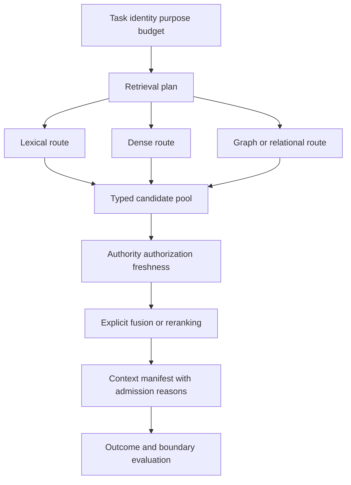

# Semantic and Retrieval Infrastructure

Retrieval is a policy that converts a task, identity, purpose, and budget into an evidence manifest. Search is only one step.

This is where Lexicon becomes task-usable Semantics. The platform keeps source authority and provenance attached while exposing canonical identifiers, typed relationships, definitions, and uncertainty to retrieval and downstream language processes. Retrieval is therefore a composable capability: a system can combine relational, lexical, vector, graph, event, or application-specific routes without pretending that one index is the meaning layer or the authority for every decision.

## Plan Before Fan-Out

The planner identifies required and optional evidence slots, authoritative sources, freshness constraints, allowed routes, deadlines, and budgets. It may use rules, semantic models, or model proposals, but trusted software validates the plan. Authorization belongs in candidate generation wherever possible; post-filtering alone can leak through queries, counts, scores, caches, or timing.

Routes return typed candidates with canonical identifiers, source versions, timestamps, provenance, policy scope, and route-specific scores. Do not compare BM25, vector similarity, graph distance, and business priority as if they shared a scale. Normalize through an explicit fusion or reranking policy and preserve each route’s contribution.

The fusion policy is part of the retrieval contract. It states which routes may contribute, how ties and duplicates are handled, which scores are comparable, how authority and freshness affect admission, and what happens when a route is unavailable. A richer candidate pool is not automatically better context: the assembler still needs a bounded budget, required evidence slots, and an auditable reason for every admission and exclusion.

### Bound the Candidate Space Before Ranking

The platform should authorize the identity and request, scope permitted sources,
entities, fields, relationships, and time ranges, and only then construct the
candidate set. Authorization must reduce the search space before relevance
ranking begins. An unauthorized record must not influence ranking, intermediate
reasoning, or generation merely because it is removed from the final manifest.

Within that governed set, vector similarity may rank what appears semantically
similar. It does not establish organizational meaning. Knowledge-graph
relationships, metadata constraints, authority, identity, policy, and temporal
applicability constrain the candidate space; pairwise comparison can then ask
which eligible candidate appears more useful; a context compiler admits bounded
evidence with provenance. Bradley–Terry can aggregate sparse pairwise preferences,
but its single latent strength should not erase distinct dimensions such as
authority, freshness, diversity, or coverage.

The resulting mechanism boundaries are deliberately separate:

| Mechanism | Question answered |
| --- | --- |
| Authorization | What may this identity access? |
| Knowledge-graph traversal | What is structurally related to this task? |
| Metadata filtering | What satisfies explicit constraints? |
| Vector retrieval | What appears semantically similar? |
| Pairwise comparison | Which of two candidates appears more useful? |
| Bradley–Terry aggregation | What ranking best explains sparse pairwise preferences? |
| Thompson sampling | Where would another evaluation be most informative? |
| Tree search | Which branches of the candidate space deserve exploration? |
| Context compiler | What bounded evidence should the model receive? |
| Downstream evaluation | Did the selected context support the correct outcome? |

Tree search organizes a branching candidate space; it does not itself provide a
trustworthy relevance score. Likewise, Thompson sampling allocates evaluation
capacity under uncertainty; it is not authorization. Use both only after the
candidate set and evaluation signal are governed. The model may decide when it
needs more context through a scoped tool, but the system decides what context
that tool may expose. Retrieval is not merely a tool-call problem. It is a
query-planning, authorization, ranking, and context-compilation problem.

## Separate Retrieval Outcomes

Record `found`, `not_found`, `unauthorized`, `stale`, `timeout`, `invalid`, and `conflict` rather than returning an empty list for every failure. The assembler decides whether each required slot can proceed, degrade, defer, or fail. It emits an ordered context manifest with inclusion and exclusion reasons.

Semantic constraints help resolve identity, validate relationships, and bound traversal. They do not establish that a source is true or authorized. Canonical records remain the authority for consequential decisions.

Keep retrieval failure visible to the caller. `not_found` means the eligible routes found no candidate; `unauthorized` means candidates existed but policy excluded them; `stale` means freshness requirements failed; `conflict` means sources disagree; and `timeout` or `invalid` identifies an infrastructure or contract failure. These outcomes lead to different fallback, escalation, and user-facing behavior. Returning an empty list for all of them destroys the evidence needed to diagnose a bad answer or an unsafe action.

## Evaluate the Pipeline by Boundary

Measure candidate recall under bounded judgments, final context precision, required-slot coverage, unauthorized candidates and admissions, freshness, latency, cost, citation support, and downstream task outcomes. Run route ablations and oracle-evidence tests. A more elaborate hybrid pipeline earns adoption only when it improves a required outcome without violating constraints.

The retrieval service returns evidence and declared uncertainty—not a prompt-sized pile of text. The next module binds that evidence to workflow state and authority.

The curriculum examples can illustrate route comparisons and retrieval metrics, but they are teaching assets rather than a production retrieval service. Keep runnable indexers, fusion policies, and authorization-aware adapters in a maintained source repository so this manuscript does not become an accidental implementation contract.

For the evidence and limitations behind pairwise ranking, Bradley–Terry
aggregation, tree search, and Thompson sampling, see [Ranked Context Selection,
Scoped Access, and Adaptive Evaluation](../../../../research/ranked-context-selection.md).
