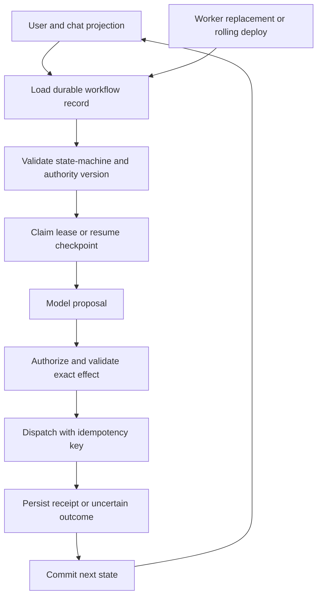

# Authorization, State, and Tooling

The model is not a security principal and its context is not an enforcement mechanism. The trusted host binds identity, delegated authority, purpose, workflow state, and resource scope before retrieval or execution.

These are Pragmatics capabilities: they determine what an actor may do with a meaningfully assembled context. They remain useful whether the consumer is an agent, a classifier, an extraction service, or a human-facing application. Middleware is a useful pattern for placing these checks between producers and consumers, but the durable design is the contract at each boundary—identity, purpose, state, authorization, validation, and effect—not a particular middleware product.

## Enforce at Every Protected Boundary

Authenticate the caller, derive narrow authority, and authorize source access at query time. Partition indexes, caches, and derived memories consistently with source policy. Record exclusions without exposing protected metadata. Before a side effect, validate the typed proposal and re-authorize the exact resource, fields, amount, and current state. Keep credentials behind a broker or proxy and give the model only opaque handles.

Defense in depth does not make violations impossible. Store policy, application checks, capabilities, network isolation, approval, and postconditions cover different bypasses. Test direct-store access, cache poisoning, cross-tenant identifiers, stale grants, time-of-check/time-of-use changes, and diagnostic replay.

## Keep State Outside the Transcript

Persist task state, plan version, evidence references, budgets, approvals, pending operations, receipts, and terminal outcomes in a durable workflow record. Session history is not that record. User and organizational memories are governed derived data with provenance, retention, correction, and deletion—not facts the model may promote merely by repeating them.

The transcript is a projection for conversation, not the recovery log. A rolling deployment may terminate the process that was holding a model response, tool call, or in-memory plan. The replacement worker should load a versioned workflow record, acquire a lease, validate the current policy and state-machine version, and resume from a checkpoint. If a step was in flight, its durable status must distinguish not-started, dispatched, acknowledged, committed, and unknown; replaying the chat cannot answer that question.

Tools expose narrow semantic contracts: operation, typed input and output, authorization scope, idempotency behavior, timeout, failure classes, and observable postconditions. The harness validates proposals, dispatches allowed work, reconciles ambiguous effects, and commits state transitions with concurrency control.

## Make Recovery a First-Class Path

Checkpoint before dispatch, use idempotency keys where supported, record provider receipts, and reconcile uncertain outcomes before retry. Revalidate approval and authority after delays. Measure denied proposals, invalid transitions, duplicate effects, stuck runs, recovery success, and operator intervention.

State restoration is not the same as replaying model tokens. Restore the operational facts needed to decide the next legal transition: the task and actor, policy versions, admitted evidence references, pending effect, lease epoch, retry history, provider receipt, and user-visible projection. Recompute ephemeral context when necessary, but do not silently recompute authority, approvals, or external effects from a new model call.

Durable execution does not make an external provider exactly once. It makes the workflow’s own transitions recoverable; provider calls still need idempotency, reconciliation, or compensation. A chat can therefore survive a pod replacement without claiming that a payment, ticket close, or message send happened twice or not at all.

The reliable platform grants the model room for judgment inside a workflow whose authority and effects remain software-controlled.
